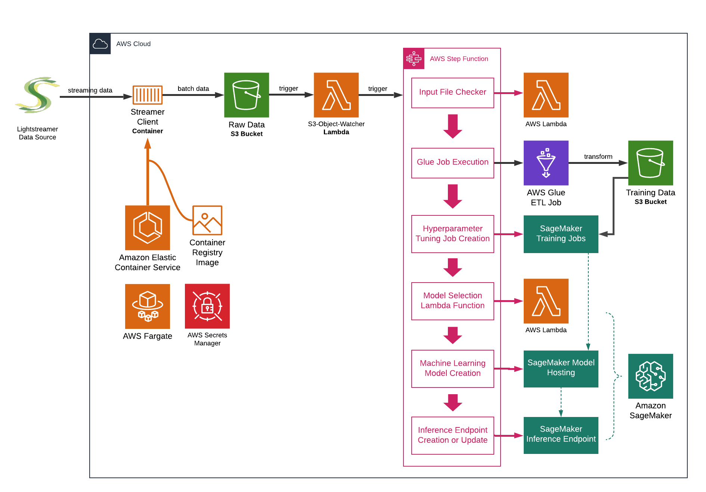

# Demo of Automated Machine Learning Model Training using Live Streaming Data on AWS 

This is a demo of using Sagemaker for automated model training and hyperparameter tuning,  with Glue ETL and Step Functions orchestration. 

## Architecture Overview



## Directory Structure

- [glue](https://github.com/yoyu777/ml-demo/tree/master/glue): Glue ETL script and dependencies
- [lambda_functions](https://github.com/yoyu777/ml-demo/tree/master/lambda_functions): Source code of Lambda functions
- [nodejs-streamer](https://github.com/yoyu777/ml-demo/tree/master/nodejs-streamer): Source code of the Streameer Client docker image
- [notebooks](https://github.com/yoyu777/ml-demo/tree/master/notebooks): Example notebooks 
- [sagemaker](https://github.com/yoyu777/ml-demo/tree/master/sagemaker): Sagemaker model training job and hyperparameter tuning job configuration templates
- [step_function](https://github.com/yoyu777/ml-demo/tree/master/step_function): State Machine definition
- [terraform](https://github.com/yoyu777/ml-demo/tree/master/terraform): Infrastructure as code and automated deploy scripts
- [project_config.cfg](https://github.com/yoyu777/ml-demo/blob/master/project_config.cfg): project level configurations 
- [requirements.txt](https://github.com/yoyu777/ml-demo/blob/master/requirements.txt): Python requirements for this project 

## How to deploy the demo in AWS

1) Activate Python environment and install dependencies for the project:

```shell
virtualenv --python=python3.8 .venv	# this project requires Python 3.8 
source .venv/bin/activate
pip install -r requirements.txt # install Python dependencies
```

2) Modify `project_config.cfg` if necessary. 
You may also want to modify the variables in `terraform/state-bucket/main.tf` (TODO: automate this).

3) Create a Service Linked Role for ECS using CLI. You may already have this role created if you used ECS in the AWS account before. 

```
aws iam create-service-linked-role --aws-service-name ecs.amazonaws.com
```

4) Deploy demo by running the `deploy.sh` script:

```shell
cd terraform
sh deploy.sh
```

When you deploy the demo for the first time, if you see the following exception, run `deploy.sh` again. It's likely to be caused by a slight delay in resource creation. 


> AccessDeniedException: Neither the global service principal states.amazonaws.com, nor the regional one is authorized to assume the provided role.

3) You need an IG API key to use the IG demo APIs. Follow [this page](https://labs.ig.com/gettingstarted) to create a free demo account and generate the API key.

The demo uses AWS Secrets Manager to store the credentials - go to [AWS Secrets Manager console](https://console.aws.amazon.com/secretsmanager/), find the newly created secret, and put in the following three key-value pairs:

```
ig_identifier: [your IG API demo account username]
ig_password: [your IG API demo account password]
ig_api_key: [the API key]
```

4) Start the Streamer Client (ECS task) by running `sh run_task.sh` in the terraform directory.

## Customise the pipeline

Some of the key configuration files are: 

- Configuration of the Streameer Client: nodejs-streamer/modules/load_config.js (if you make changes to the client, you will have to build and deploy the docker image yourself)
- ECS task definition template: `terraform/service/template-data-collector-container-definition.json`, especially if you want to use your own docker image
- The Glue job: you can either make changes to `glue/glue-etl.ipynb`(then export as glue-etl.py using jupyter magic) or directly to `glue/glue-etl.py`, depending on your preference
- Sagemaker model training job and hyperparameter tuning job configurations: `sagemaker/training_job_definition.json` and `sagemaker/tuning_job_config.json`
- State Machine definition: `step_function/state_machine_definition.json` (however, the training and tuning job definition parts will be overwritten by the two files above)

Do not modify other files, including `.tfvars`, unless you know what you are doing. 

## Destroy the deployment

```shell
cd terraform
sh destroy.sh
```

